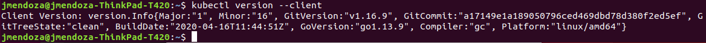
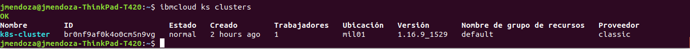
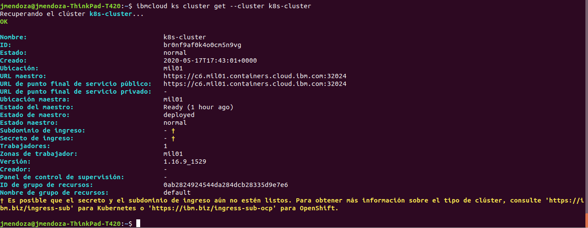
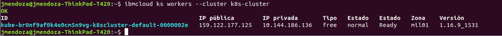
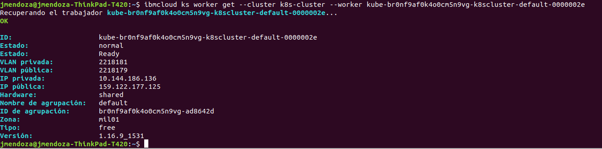
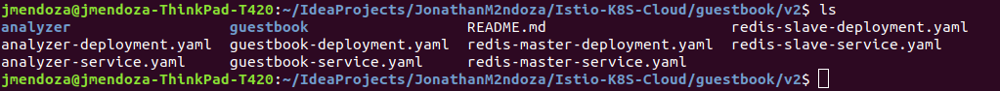
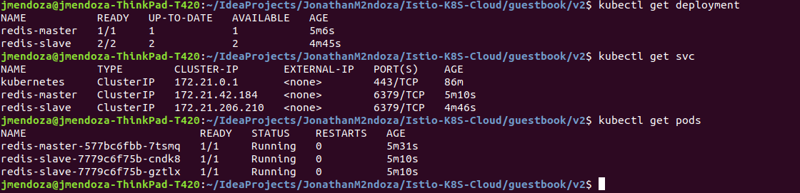
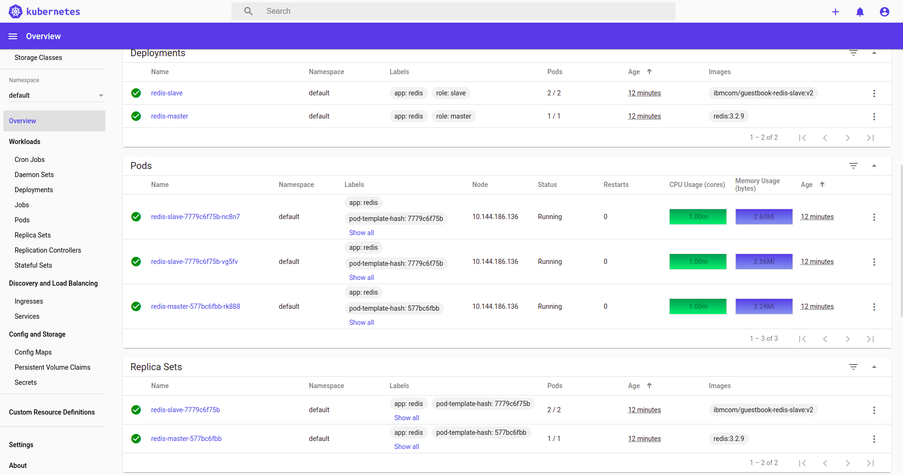
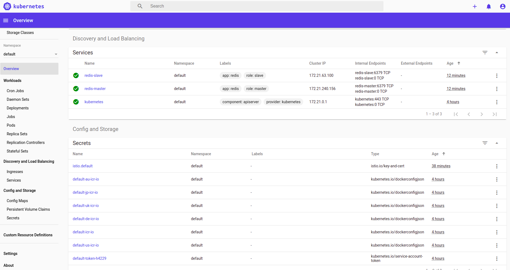
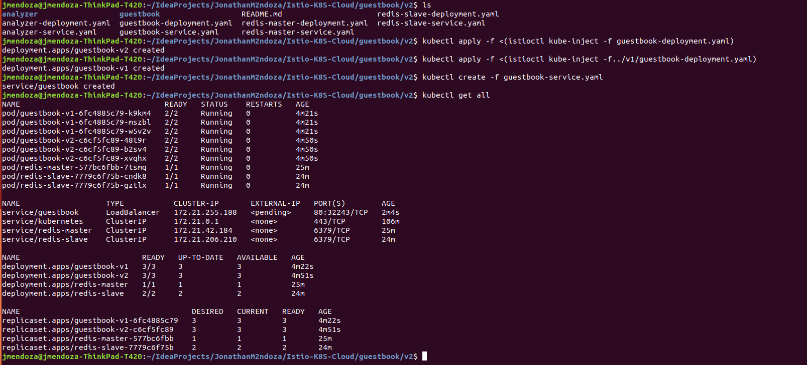

# Istio-K8S-Cloud

Example of how use Istio and IBM Cloud Kubernetes Service.

## Install the IBM Cloud command-line interface (CLI) and Create Kubernetes Cluster

jmendoza@jmendoza-ThinkPad-T420:~$ curl -sL https://ibm.biz/idt-installer | bash

### Log in to the IBM Cloud CLI. If you have a federated account, include the --sso flag

jmendoza@jmendoza-ThinkPad-T420:~$ ibmcloud login --sso

###  Verify that the plug-in is installed properly

The service plug-in is displayed in the results as container-service/kubernetes-service.

###  Check version of Kubectl

### Create Kubernetes cluster in IBM Cloud

### Set the context for your cluster in your CLI

jmendoza@jmendoza-ThinkPad-T420:~$ ibmcloud ks clusters

jmendoza@jmendoza-ThinkPad-T420:~$ ibmcloud ks cluster config --cluster k8s-cluster

### Get basic information about your cluster and its worker nodes

jmendoza@jmendoza-ThinkPad-T420:~$ ibmcloud ks clusters 

jmendoza@jmendoza-ThinkPad-T420:~$ ibmcloud ks cluster get --cluster k8s-cluster

jmendoza@jmendoza-ThinkPad-T420:~$ ibmcloud ks workers --cluster k8s-cluster

jmendoza@jmendoza-ThinkPad-T420:~$ ibmcloud ks worker get --cluster k8s-cluster --worker kube-br0nf9af0k4o0cm5n9vg-k8scluster-default-0000002e

### Working directory 

cd istio101/workshop

This is the working directory for the course labs. Use the sample .yaml files that are located in the workshop/plans directory for the labs.

## Install Istio on IBM Cloud Kubernetes Service

1- Either download Istio from https://github.com/istio/istio/releases or get the latest version by using curl:

jmendoza@jmendoza-ThinkPad-T420:~$ curl -L https://git.io/getLatestIstio | sh -

2- Add the istioctl client to your PATH variable. The <version-number> is in the directory name.

Begin the Istio pre-installation verification check by running:
	 istioctl verify-install 
 

3- Change the directory to the Istio file location.

jmendoza@jmendoza-ThinkPad-T420:~$ cd istio-1.5.4/

4- Install Istio into the istio-system namespace in your Kubernetes cluster:

jmendoza@jmendoza-ThinkPad-T420:~/istio-1.5.4$ kubectl apply -f $PWD/install/kubernetes/istio-demo.yaml

5- Ensure that the istio-* Kubernetes services are deployed before you continue:

jmendoza@jmendoza-ThinkPad-T420:~$ kubectl get svc -n istio-system

Note: For Lite clusters, the istio-ingressgateway service will be in pending state with no external ip. This is normal.

6- Ensure the corresponding pods istio-citadel-*, istio-ingressgateway-*, istio-pilot-*, and istio-policy-* are all in the Running state before you continue.

jmendoza@jmendoza-ThinkPad-T420:~$ kubectl get pods -n istio-system

Before your continue, make sure all the pods are deployed and running. If they're in pending state, wait a few minutes to let the deployment finish.

Congratulations! You successfully installed Istio into your cluster.

## Download the Guestbook app and create the Redis database

1- Change to the app directory:

Next, you create a Redis database so that you can use to persist the data of your app. The Redis database comes with master and slave modules.

2- Create the Redis controllers and services for both the master and the slave:

jmendoza@jmendoza-ThinkPad-T420:~/IdeaProjects/JonathanM2ndoza/Istio-K8S-Cloud/guestbook/v2$ kubectl create -f redis-master-deployment.yaml

jmendoza@jmendoza-ThinkPad-T420:~/IdeaProjects/JonathanM2ndoza/Istio-K8S-Cloud/guestbook/v2$ kubectl create -f redis-master-service.yaml

jmendoza@jmendoza-ThinkPad-T420:~/IdeaProjects/JonathanM2ndoza/Istio-K8S-Cloud/guestbook/v2$ kubectl create -f redis-slave-deployment.yaml

jmendoza@jmendoza-ThinkPad-T420:~/IdeaProjects/JonathanM2ndoza/Istio-K8S-Cloud/guestbook/v2$ kubectl create -f redis-slave-service.yaml

3- Verify that deployment and service are created:

## Install the Guestbook app with manual sidecar injection

In Kubernetes, a sidecar is a utility container in the pod, and its purpose is to support the main container.

For Istio to work, Envoy proxies must be deployed as sidecars to each pod of the deployment. You can inject the Istio sidecar into a pod in two ways:

- Manually by using the istioctl CLI tool
- Automatically by using the Istio Initializer

In this section, you will use the manual injection. Manual injection modifies the controller configuration, for example, deployment. It does this by modifying the pod template spec such that all pods for that deployment are created with the injected sidecar.

1- Inject the Istio Envoy sidecar into the guestbook pods and deploy the Guestbook app on to the Kubernetes cluster:

jmendoza@jmendoza-ThinkPad-T420:~/IdeaProjects/JonathanM2ndoza/Istio-K8S-Cloud/guestbook/v1$ kubectl apply -f <(istioctl kube-inject -f guestbook-deployment.yaml)
deployment.apps/guestbook-v1 created

There are two versions of deployments: a new version (v2) in the current directory and a previous version (v1) in a sibling directory. They will be used in future labs to showcase the Istio traffic routing capabilities.

2 - Create the guestbook service:

jmendoza@jmendoza-ThinkPad-T420:~/IdeaProjects/JonathanM2ndoza/Istio-K8S-Cloud/guestbook/v1$ kubectl create -f guestbook-service.yaml
service/guestbook created

3- Verify that the service was created and that the pods are running:

