# Istio-K8S-Cloud

Example of how use Istio and IBM Cloud Kubernetes Service.

## Create Kubernetes cluster in IBM Cloud

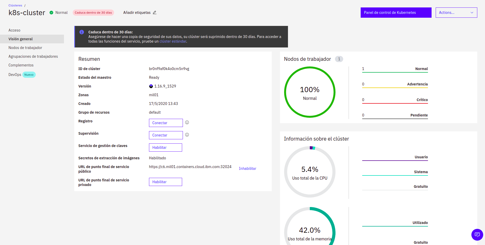

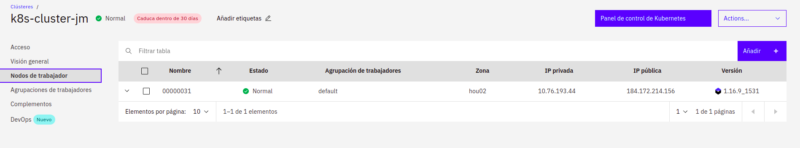

### Log in to the IBM Cloud CLI. If you have a federated account, include the --sso flag

jmendoza@jmendoza-ThinkPad-T420:~$ ibmcloud login --sso

###  Verify that the plug-in is installed properly

The service plug-in is displayed in the results as container-service/kubernetes-service.

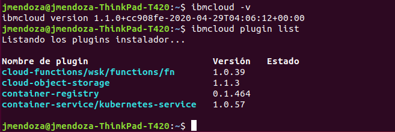

### Set the context for your cluster in your CLI

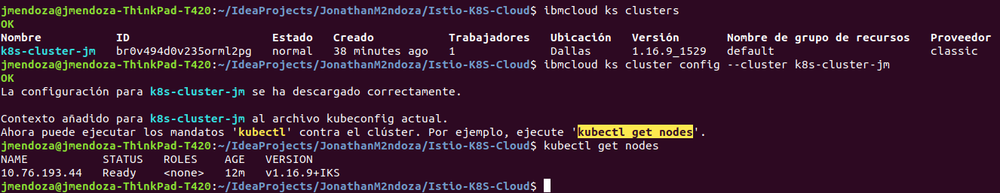

## Install Istio on IBM Cloud Kubernetes Service

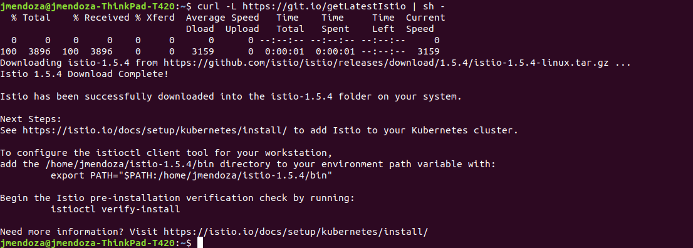

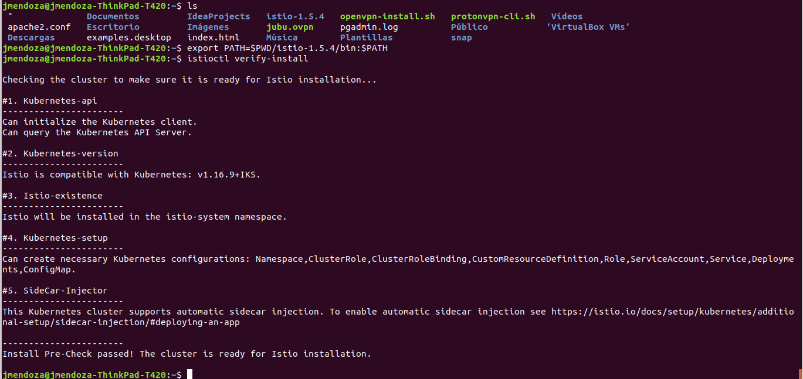

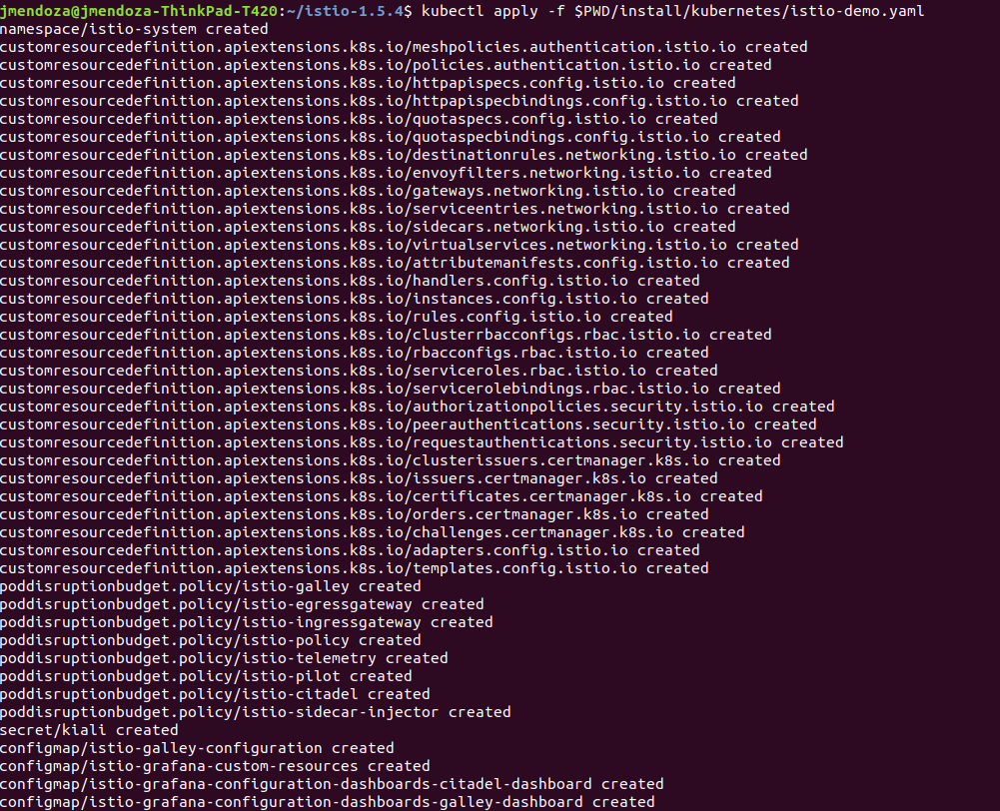

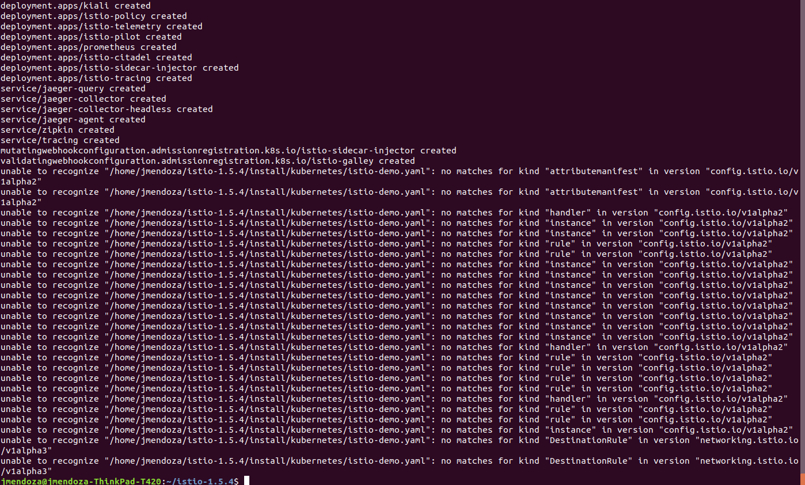

Ensure that the istio-* Kubernetes services are deployed before you continue:

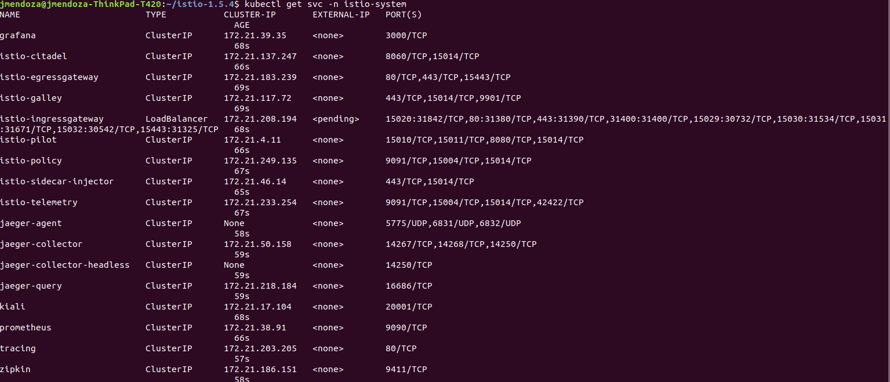

Ensure the corresponding pods istio-citadel-*, istio-ingressgateway-*, istio-pilot-*, and istio-policy-* are all in the Running state before you continue.

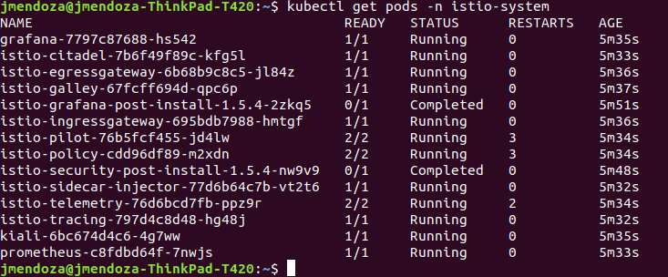

## Download the Guestbook app and create the Redis database

Create the Redis controllers and services for both the master and the slave:

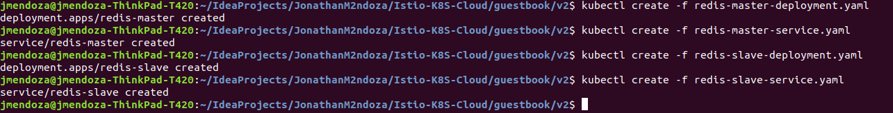

