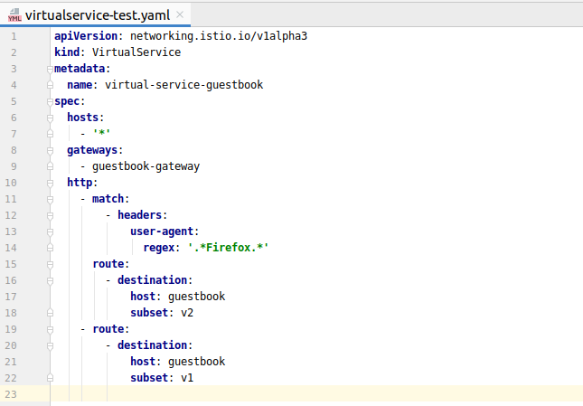
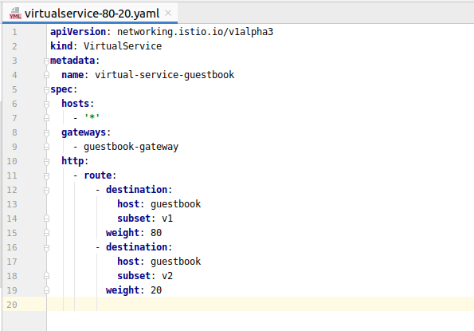
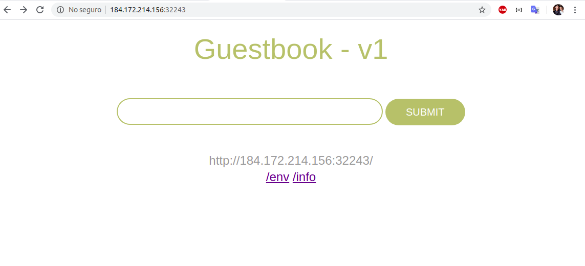
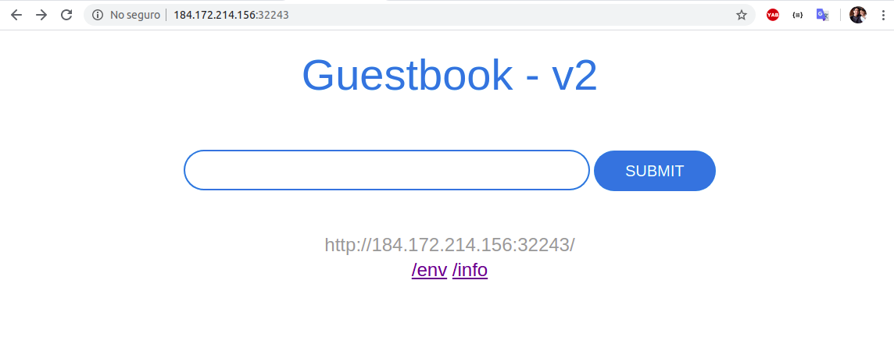

# Istio-K8S-Cloud

Example of how use Istio and IBM Cloud Kubernetes Service.

## Create Kubernetes cluster in IBM Cloud


### Log in to the IBM Cloud CLI. If you have a federated account, include the --sso flag

jmendoza@jmendoza-ThinkPad-T420:~$ ibmcloud login --sso

###  Verify that the plug-in is installed properly

The service plug-in is displayed in the results as container-service/kubernetes-service.


### Set the context for your cluster in your CLI


## Install Istio on IBM Cloud Kubernetes Service


Ensure that the istio-* Kubernetes services are deployed before you continue:


Ensure the corresponding pods istio-citadel-*, istio-ingressgateway-*, istio-pilot-*, and istio-policy-* are all in the Running state before you continue.


## Download the Guestbook app and create the Redis database

Create the Redis controllers and services for both the master and the slave:


## Install the Guestbook app with manual sidecar injection


## Add the Watson Tone Analyzer

Create the Watson Tone Analyzer in your account:

```shell
jmendoza@jmendoza-ThinkPad-T420:~/IdeaProjects/JonathanM2ndoza/Istio-K8S-Cloud/istio101/workshop/plans$ ibmcloud resource service-instance-create jm-tone-analyzer-service tone-analyzer lite us-south
```


## Configure Istio to receive telemetry data


### View guestbook telemetry data with Jaeger

Generate a small load to the app


  ```shell
     jmendoza@jmendoza-ThinkPad-T420:~/IdeaProjects/JonathanM2ndoza/Istio-K8S-Cloud/istio101/workshop/plans$ kubectl port-forward -n istio-system \>   $(kubectl get pod -n istio-system -l app=jaeger -o jsonpath='{.items[0].metadata.name}') \
     >   16686:16686 &
     [1] 15252
     jmendoza@jmendoza-ThinkPad-T420:~/IdeaProjects/JonathanM2ndoza/Istio-K8S-Cloud/istio101/workshop/plans$ Forwarding from 127.0.0.1:16686 -> 16686
     Forwarding from [::1]:16686 -> 16686
     Handling connection for 16686
     Handling connection for 16686
     Handling connection for 16686
  ```


## Expose the Guestbook app with Ingress if you have lite cluster


## Perform A/B testing with Istio


To enable the Istio service mesh for A/B testing against the new service version, modify the original VirtualService rule:

  ```shell
     jmendoza@jmendoza-ThinkPad-T420:~/IdeaProjects/JonathanM2ndoza/Istio-K8S-Cloud/istio101/workshop/plans$ kubectl replace -f virtualservice-test.yaml
     virtualservice.networking.istio.io/virtual-service-guestbook replaced
  ```



In Istio VirtualService rules, there can be only one rule for each service and therefore when defining multiple HTTPRoute blocks, the order in which they are defined in the YAML file matters. Therefore, you should modify the original VirtualService rule rather than creating a new rule. With the modified rule, incoming requests originating from Firefox browsers will go to the newer version of guestbook. All other requests fall through to the next block, which routes all traffic to the original version of guestbook.

The ServiceEntry defines addresses and ports that services within the mesh are allowed to make requests to. If two browsers are available on your system, observe the modernized guestbook service in Firefox and the original guestbook service in any other browser.

### Firefox (Guestbook service - V2)


### Other browser (Guestbook service - V1)


## Incrementally roll out changes with canary deployments

  ```shell
     jmendoza@jmendoza-ThinkPad-T420:~/IdeaProjects/JonathanM2ndoza/Istio-K8S-Cloud/istio101/workshop/plans$ kubectl replace -f virtualservice-80-20.yaml
     virtualservice.networking.istio.io/virtual-service-guestbook replaced
  ```



You should notice that the guestbook should swap between V1 or V2 at about the weight you specified.






