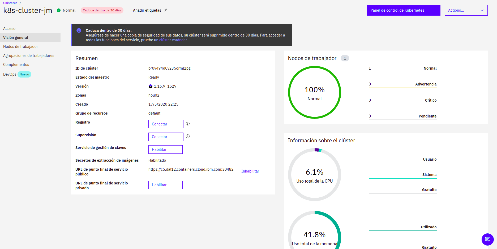

# Istio-K8S-Cloud

Example of how use Istio and IBM Cloud Kubernetes Service.

### Install the IBM Cloud command-line interface (CLI) 

jmendoza@jmendoza-ThinkPad-T420:~$ curl -sL https://ibm.biz/idt-installer | bash

### Log in to the IBM Cloud CLI. If you have a federated account, include the --sso flag

jmendoza@jmendoza-ThinkPad-T420:~$ ibmcloud login --sso

###  Verify that the plug-in is installed properly

The service plug-in is displayed in the results as container-service/kubernetes-service.

###  Check version of Kubectl

### Create Kubernetes cluster in IBM Cloud

### Set the context for your cluster in your CLI

jmendoza@jmendoza-ThinkPad-T420:~$ ibmcloud ks clusters

jmendoza@jmendoza-ThinkPad-T420:~$ ibmcloud ks cluster config --cluster k8s-cluster

### Get basic information about your cluster and its worker nodes

jmendoza@jmendoza-ThinkPad-T420:~$ ibmcloud ks clusters 

jmendoza@jmendoza-ThinkPad-T420:~$ ibmcloud ks cluster get --cluster k8s-cluster

jmendoza@jmendoza-ThinkPad-T420:~$ ibmcloud ks workers --cluster k8s-cluster

jmendoza@jmendoza-ThinkPad-T420:~$ ibmcloud ks worker get --cluster k8s-cluster --worker kube-br0nf9af0k4o0cm5n9vg-k8scluster-default-0000002e

